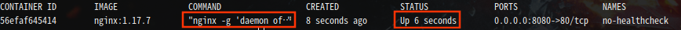
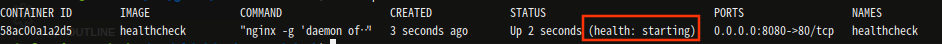
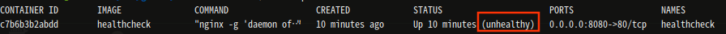
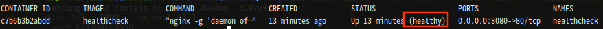

# Docker Health Check

Health check is specified in a `Dockerfile` using the`HEALTHCHECK` directive.

## Tests no-healthcheck and with HealthCheck

```bash
docker build -t no-healthcheck -f docker/Dockerfile docker/
docker run -d --rm --name no-healthcheck -p 8080:80 no-healthcheck
```


---
```bash
docker build -t healthcheck -f docker/Dockerfile.healthcheck docker/
docker run -d --rm --name healthcheck -p 8080:80 healthcheck
```



---
Apos 30 segundos



---
```bash
docker exec -it healthcheck sh -c 'echo OK > /usr/share/nginx/html/system-status.txt'
```


## References

* [Docker Docs](https://docs.docker.com/engine/reference/builder/)
* [BetterProgramming - Nassos Michas](https://medium.com/better-programming/docker-healthchecks-eb744bfe3f3b)
